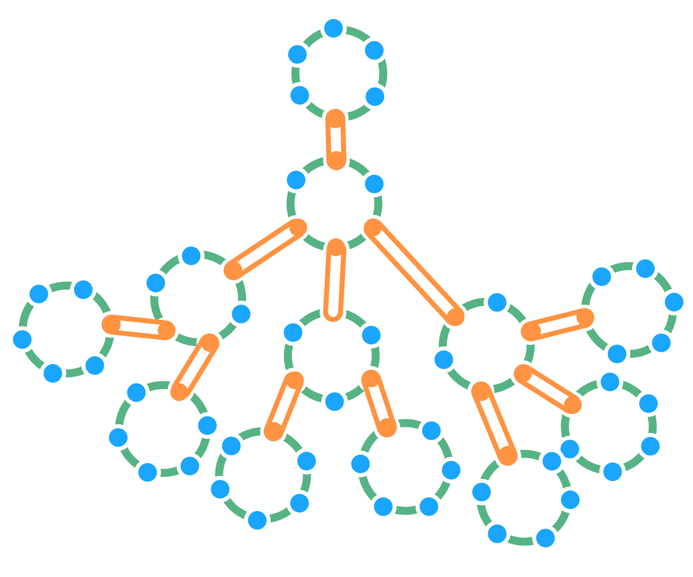

A pattern for the early phase of a transformation.

In a double-linked hierarchy, the flow of information and influence between adjacent levels of the hierarchy is balanced through sending delegates upwards and downwards. 

Each level of the hierarchy is made up of a team (instead of individuals). 

Each team on a lower level selects one delegate to represent them in the team on the next higher level. Each team on a higher level sends selects one delegate to each team on the lower levels. This way, there's always two people familiar with the perspective of each team present in decision making on the next higher level. Also, when making decisions on the lower levels, there's always two people present who can bring in the perspective of the next higher level.
