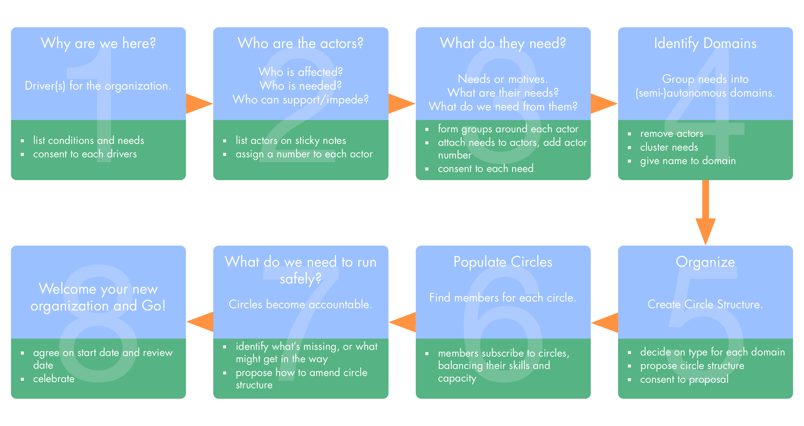

## Why are we here?

(Drivers for the organization)

* conditions and needs
* consent to primary/each driver

## Who are the actors?

* Who is impacted?
* Who is needed?
* Who can obstruct?

Assign a number to each actor.

## What do we/they need?

Needs or motives (subdrivers)?

* What are their needs?
* What do we need from them?

* (in a large group: form smalls group around each actor)
* add needs on stickies to each actor and add the actor’s number
* make sure group consents to each needs

## How to respond to needs?

What could (help) to fulfill the needs: the deliverables and expectations.

* actions
* products or services
* agreements

Brainstorm ideas and attach them to needs.

## Domains

Remove actors and group needs into logical clusters, those are your domains (circles, roles, or agreements).

Give a meaningful name to each domain.

Consolidate the driver, add conditions, set boundaries/scope of domain (can also be done later) 

Sort deliverables into work backlog (work items, clear, well-defined) and governance backlog (meta-items, large, uncertain, impact way of working)

Brainstorm challenges, impediments, risks and opportunities for each domain and add to governance backlog.

## Organize

Process each domain in turn: circle or role (or agreement)?

Create proposal for circle structure (including roles, if any), use delegate circles to link domains as needed.

Consent to proposal.

Add role selections and agreements to governance backlogs.

## Populate circles

Agree on members for each circle

## Go

Hold first governance meeting, then start working

Create role descriptions and hold selections for roles (including delegates)

Prioritize work and governance backlogs

