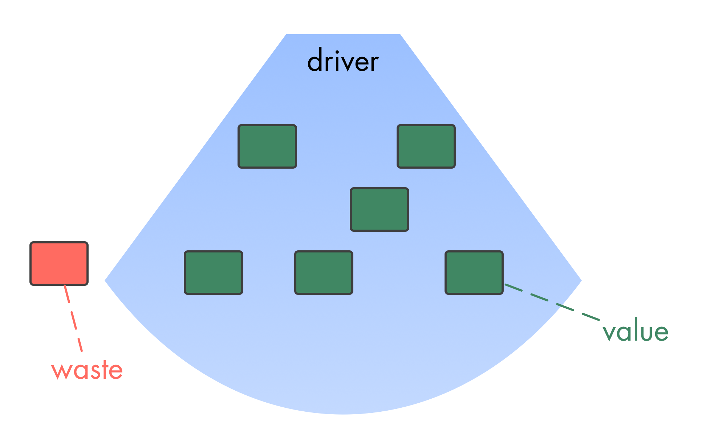

The **driver** is the reason and the motivation for action in a specific situation: the needs a team or organization identifies and chooses to address, and the conditions relevant to understanding these needs.

{>> older version: A **driver** is what motivates us into action in a specific situation: the **needs** we perceive, and the **conditions** from which these needs arise. <<}

A driver can apply to an individual, or describe **collective motivation for a group**. Developing shared understanding of drivers fosters **alignment towards the motive** instead of towards our assumptions about the future. The response to a driver always involves the **adaptation of an existing agreement, or creation of a new one**, including:

* changing the plan: adding a task or project
 * adaptation  or creation of a role
 * creation of a new circle

However, sometimes we may decide against responding to a driver, because there is more important things to tend to.

### Needs and Conditions ###

A **need** is the lack of something that is necessary (required?) or important

Needs are identified when analyzing a situations, and may related to the organization itself, its members, stakeholders, customers or the environment. 
Needs can be objective (physical) or subjective (psychological), and may be controversial on a social level. An organization's values may help resolving controversies

Some examples for needs, from more abstract needs to personal needs: 

* revenue, profit, shareholder value, capital
* customer value
* autonomy, mastery, purpose
* connection, collaboration, recognition
* sustenance, happiness

Each need emerges through one or several conditions. In order to understand a driver, we need to identify relevant and important conditions for each need, and describe them,  usually as facts or observations.

Over time, we will develop better understanding of a driver, and, as the needs and conditions change, update the driver's description. 

We review a review whenever we review a strategies or agreements which respond to that driver. In a driver review we discover new or changed needs and conditions, sometimes the driver no longer falls into our domain, or is no longer relevant.

## Drivers and Lean Thinking ##

### Value and Waste ###

Lean Thinking is centered around the ideas of value and waste, both can easily be defined in relation to a driver: 

* **value** is the importance, worth or usefulness of something for responding to a driver.
* **waste** is anything not necessary (or essential) for - or standing in the way of - effective response to a driver.

In this context, value is **not** an **inherent** property as it only exists in relation to a driver. This is why value is not necessarily expressed in currency or time, but it often can be quantified by identifying metrics related to the needs or conditions contained in a driver. 

Adopting the concept of value and waste makes many tools and ideas from **lean production** and **lean software development** available to support organizations running on Sociocracy 3.0:

* value stream mapping
* various strategies for eliminating waste
* the Kanban Method

###  Waste and Continuous Improvement

Waste exist in many different forms and on different levels of abstraction, e.g. in tasks, agreements, work processes, organizational structure or mental models. Waste makes itself known as tensions, learning learning to identify waste is a long journey, but along the way we also discover wisdom that helps us evolve our understanding of our drivers.

Establishing a process for ongoing elimination of waste enables the natural evolution of an organization towards greater effectiveness, optimizing the flow of value through an organization. As a side effect, the organization will so naturally adapt  to changes in the environment.

