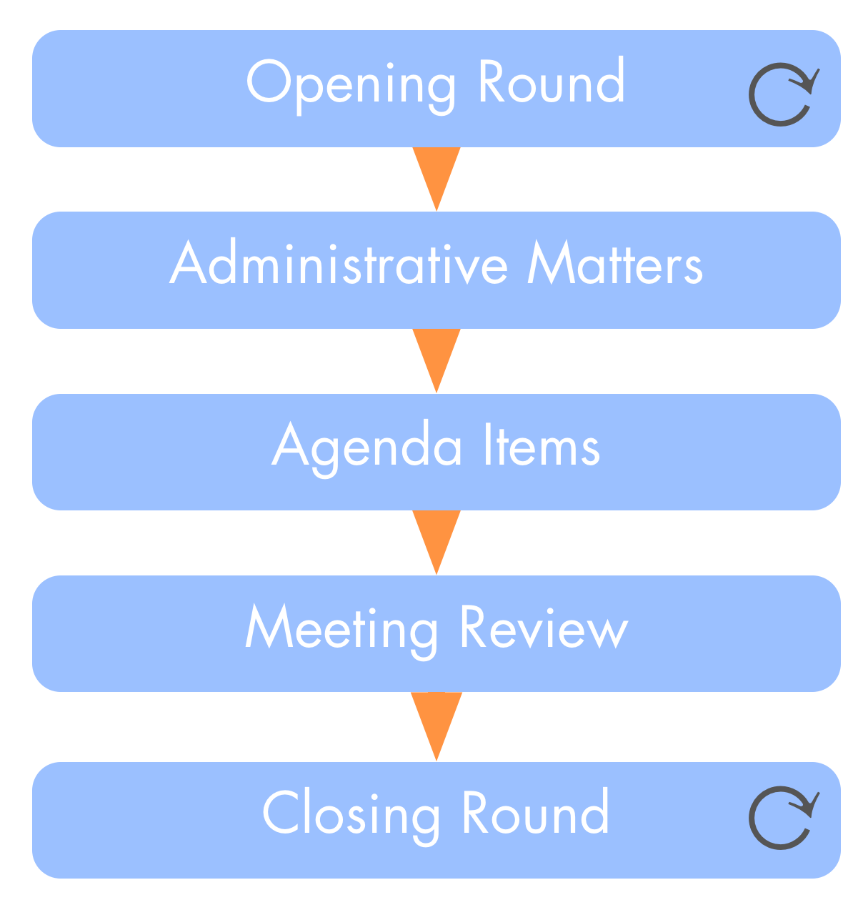

---
title: Governance Meeting
---

## What Is It? ###

A governance meeting is a (usually **weekly or bi-weekly**) meeting where the whole team gathers to make and review policy decisions that guide their operations.

A governance meeting happens in __regular intervals__ or on demand, and usually is structured in a way that allows for effective processing of administrative concerns and agenda items. 

A good governance meeting is time-boxed to 60 minutes, contains little or no discussion and ends with an evaluation of the meeting itself. A group should aim for processing an agenda item in 5 minutes or less, which can be achieved through a combination of good preparation, artful facilitation and [Artful Participation][].

##  Why use it? ##

Having a regular cadence of making and evolving agreements supports a circle in effective collaboration, continuous improvement, and adapting to change.

## How to implement it? ##

The following structure has proven to be effective for governance meetings.

1. __Opening round:__ any "ritual" that allows the group to attune to each other and become present, e.g. a round of check-ins
2. __Administrative Concerns__: announcements, consent to minutes of the last governance meeting, accepting  the agenda
3. __Agenda Items__: each agenda item should have an "owner" who can present the item and answer questions about it
4. __Closing:__ review of meeting [Meeting Evaluation][] and results, future agenda items

