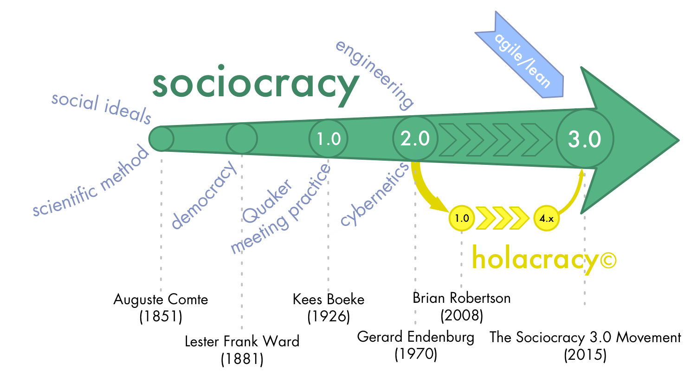
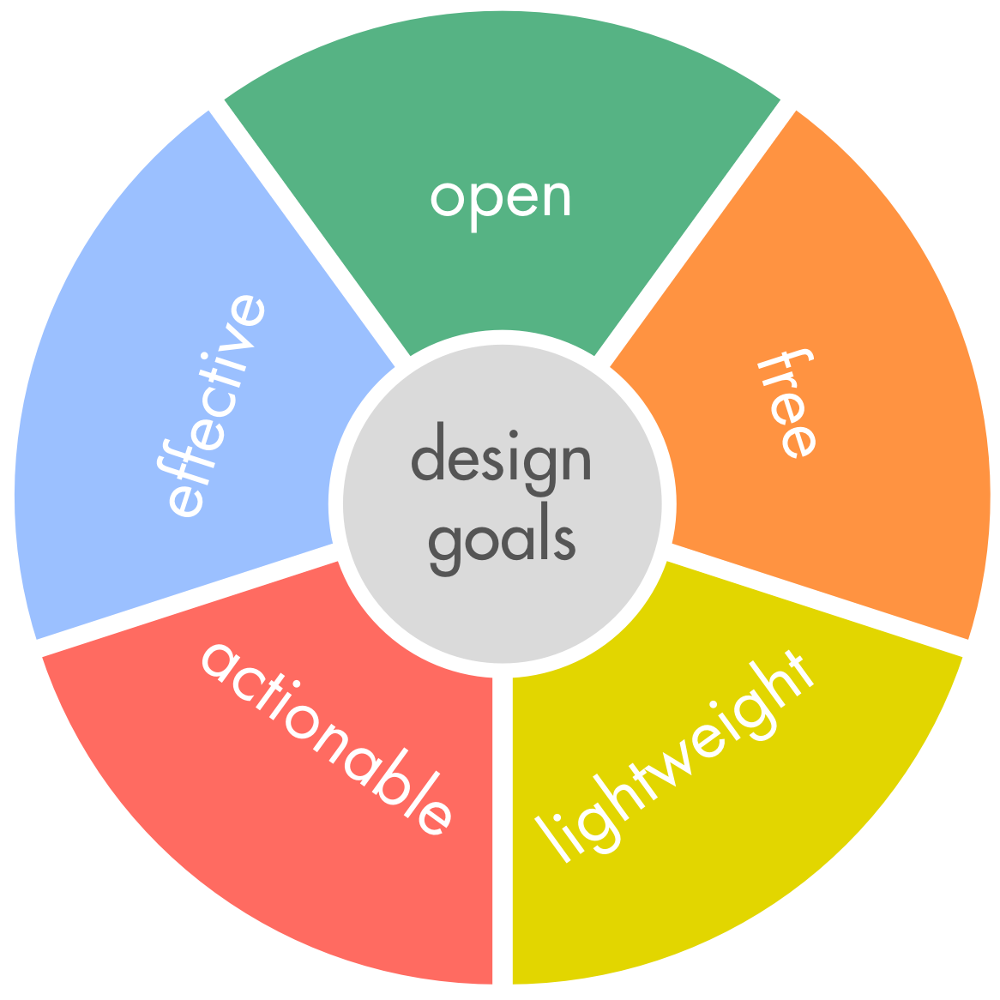
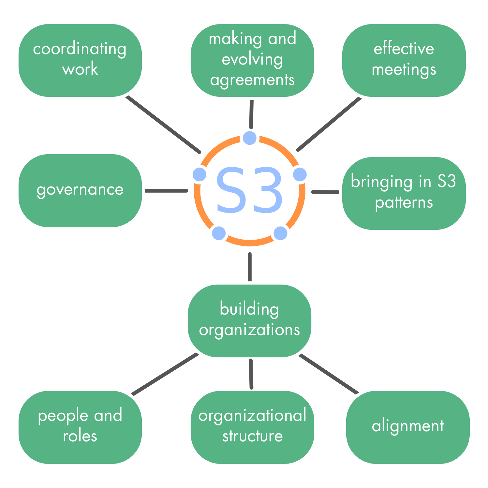

## What is Sociocracy 3.0?

Sociocracy 3.0 (also known as S3) is a **framework of patterns for collaboration in organizations** that wish to grow more **effective, agile and resilient**.

It be applied in organizations of **any size,** from small start-ups to large international networks and nationwide, multi-agency collaboration.

S3 contains patterns ready to use for many different aspects of collaboration, including patterns that enable organizations to discover and develop new patterns according to their needs. 

The patterns in S3 form a pattern language, i.e. while each pattern can be applied independently, patterns mutually reinforce each other, because they are all based on the same set of principles (see the *Seven Principles* at the end of the introduction). 

S3 patterns facilitate positive transformation for individuals, teams and whole organizations by enabling people to..:

* ...**dynamically steer and evolve** their organizations.
* ...commit to agreements and account for the consequences
* ...learn, transform and grow
* ...incrementally process available information into **continuous improvement of products, processes and skills***.
* ... make the best use of the skills already present
* ... grow flexible organizational structures in support of effective flow of information.
* ...take an **open, iterative approach to adoption** that meets organizations where they are and enables them to move forward at their own pace. 
* ...draw on the *collective intelligence* of the group.
* ...develop creative strategies that are “**good enough for now**” and “**safe enough to try**”.

The focus of this handbook is  mostly on S3 in the context of organizations. The patterns themselves are valuable to any group of people who wish to collaborate effectively, including communities, municipalities, families, and even one-to-one relationships.

## A Brief History of Sociocracy  from 1851 to today ##

**What’s in a word?**

* *socio-* from Latin *socius* - companion, friend
* *-cracy*  from Ancient Greek krátos - “power, rule”
* different to the rule of the *demos* (i.e. the general mass of people with voting privileges)

* 1851 – Auguste Comte
    * Scientific method applied to society
    * Sociocracy is “*the social order of the future*” - not yet achievable but inevitable!
* 1881 – Lester Frank Ward
    * redefined the term Sociocracy to describe the rule of the people with relationships with each other 
* 1926 -1954 - Kees Boeke
    * Established the first sociocracy in his residential school (based on Quaker consensus principles)
    * Book “*Sociocracy: Democracy as it might be*” (1945)
* 1970's - Gerard Endenburg
    * Student in Kees Boeke’s school
    * Integrated principles from Engineering and Cybernetics
    * In his company Endenburg Electrotechniek he evolved “*The Sociocratic Circle-Organization Method*” (later becoming "*The Sociocratic Method*")
* 1978 - Sociocratisch Centrum Utrecht
    * created to promote "*The Sociocratic Method*"
* 1994 -  New law in the Netherlands
    * Sociocratic organizations are no longer required to have a worker’s council
* 2000 - emergence of a now wide-spread grassroots movement 
* 2007 - *We the People*
    * John Buck / Sharon Villines make Sociocracy accessible to the English-speaking world
* 2014 The Sociocracy 3.0 Movement is born

## The S3 Movement ##

The S3 Movement is a **distributed network consultants and trainers** from a variety of fields, who...

* ...dedicate their time to developing and evolving S3 to make it **available and applicable to as many organizations as possible**.

* ...provide resources under a **Creative Commons Free Culture License** to learn, practice and teach Sociocracy 3.0.

* ...share a deep appreciation for the transformational potential of S3 to help organizations and their members thrive. 

## Why "Sociocracy 3.0" ##

**Respect to the lineage of Sociocracy, and a step forward:**

* an approach towards organizational change that meets organizations where they are
* integrated with lean and agile thinking
* new ways to evolve organizational structure
* patterns for all aspects of collaboration, not just for governance

### Design Goals ###

**Open**: Principle-based and modular patterns make it easy to choose and adapt according to context

* do with it what you want
* take just what you need
* remix, extend and adapt it as you like

**Free**: Un-centralized distribution and a Commons license eliminates barriers to entry:

* free and accessible resources
* no hidden fees
* no  certifications 
* no small print

**Effective**: Principles and patterns have been tried and tested in many organizations, often for decades.

* need-driven
* value-driven
* customer/user  focus
	
**Actionable**: There's something any organization can use right now, regardless of their unique context. S3 contains lots of ideas anyone can try out within their area of influence.

* patterns for individuals
* patterns for groups
* patterns for organizations

**Lightweight**: Just the essentials: common-sense practices, bare-bone processes:

* free of stuff that gets in the way
* no busywork or unnecessary bureaucracy

{{seven-principles.md}}

## Patterns ##

A **pattern** is a template for successfully navigating a specific context. 

S3 patterns are discovered through observing many organizations as they solve problems, innovate, and respond to opportunities. Patterns may need to be adapted and evolved to suit differing contexts and needs.

The more than 60 patterns on S3 are organized in 7 pattern groups. 

