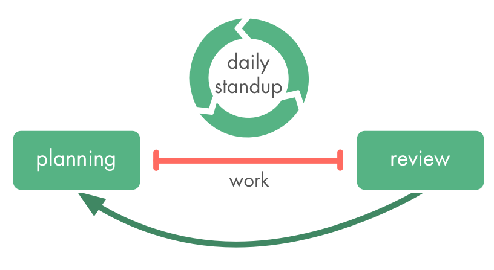

When working on products or larger projects that will take weeks or even months to finish, it's often helpful to break them down into smaller parts in order to effectively manage both work itself and expectations of stakeholders.

These parts are commonly called *milestones*, which usually take more than an month to achieve, and whose duration usually extends until work is finished, or *iterations*, which are fixed in duration (usually 1-4 weeks), unfinished items are handed over to the next iteration.

At the beginning of the milestone or iteration there is a *planning meeting* where the circle decides on the timeframe and on how much work to pull in for that period. It's helpful to timebox the meeting to just a few hours, and prepare a prioritized product or project backlog with the topmost items already estimated by the circle. 

During the planning session, value, risk and dependencies between work items are discussed, work items are estimated, and, if time allows, broken down into small tasks that can be executed independently. For a successful milestone or iteration, circles often identify a theme, topic or goal, and select work items accordingly. 

In the *review meeting* at the end of the iteration or milestone, the circle inspect the results, 
sometimes bringing in external stakeholders, the output of the review meeting is fed back into the next planning meeting.

