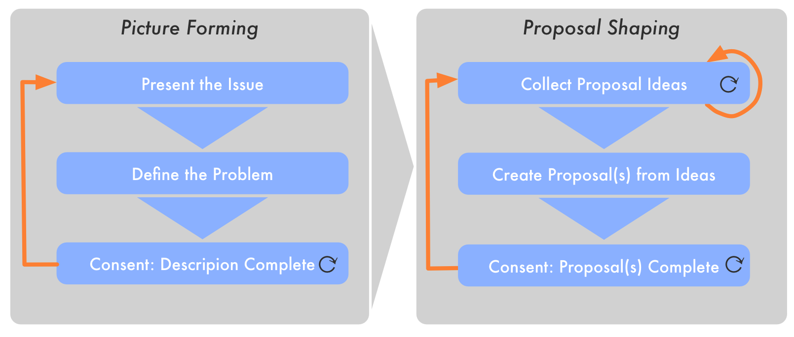

Proposal Forming is a facilitated meeting format designed to tap the collective intelligence of a group. It fosters accountability and a sense of ownership by involving participants in co-creating a proposal for an agreement.

This proposal creation process is similar to the Design Thinking Process, with divergent phases to first bring clarity about the problem domain and then explore the solution domain, followed by a converging phase where the several individual pieces of solutions are integrated into a workable proposal that can be consented to by the group. It's suited for  issues of small to medium-sized complexity. For a big issue, proposal forming can be used to co-create a strategy for approaching them, e.g. designing a special workshop, or breaking it down into smaller parts, and process them individually.

Proposal Forming happens in two stages: *picture forming* and *proposal creation*.

### Picture Forming ###

Picture forming is done with the whole group and requires a facilitator.

#### Present the Issue ####

#### Define the Problem ####

Collect all considerations for a possible solution: all elements and dimensions of the problem, questions that would need to be answered, and any criteria a successful solution would need to fulfill. 

Remain in the problem space to see the issue from all angles, do not propose solutions yet, as they would not only be incomplete at this stage, but also limit your abilities to arrive at a shared understanding of the complete picture. 

An elegant way of collecting considerations is in the form of generative questions, e.g. "how can we make sure we stay within budget?" instead of "budget (!)". 

#### Consent to the description as being complete ####

The facilitator leads a consent round, any objections are integrated into the list of considerations.

### Proposal Shaping ###

#### Collect Proposal Ideas ####

With all considerations visible to the group the facilitator leads several rounds to generate proposal ideas ("_How might we resolve that issue?_"). Instead of judging or evaluating ideas expressed by others, participants simply add new suggestions that build on previous ones.

For more complex issues it's good practice for participants to write their ideas on sticky notes, so that the facilitator can already organize and group ideas.

The facilitator needs to take into account that often it may take a few rounds for ideas to flow freely.

When the group runs dry of ideas, the facilitator may point out the individual considerations in turn and ask the group if they think there's enough ideas around each one.

#### Create Proposal(s) From Ideas ####

This is most effectively completed by a small group of _tuners_ (2-4 participants), who mostly maintain a neutral attitude when integrating ideas into manageable and complete proposals, creatively bridging any gaps they might encounter. 

To prepare this phase, the facilitator asks the group who will tune the proposal, and helps the tuners schedule their tuning session.

The finished proposal(s) are then shared with all members of the group.

#### Consent to Completeness of Proposals ####

The whole group consents to the completeness of the proposal, either synchronously in a consent round or individually (e.g. via email). If the proposals are incomplete, the group gathers again to generate new ideas for proposals.

If the proposals are complete, the whole group needs to consent to it, for that they usually go on the agenda in the [Governance Meeting][] and is processed using [Consent Decision Making][].