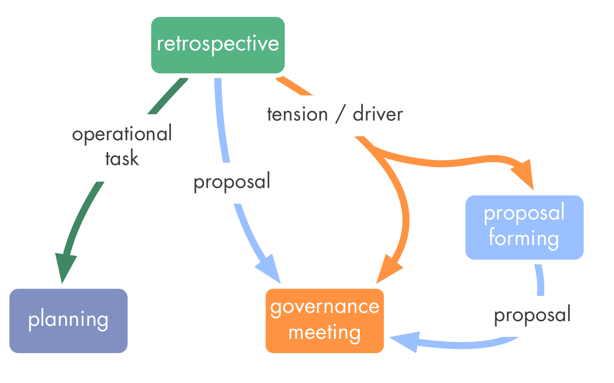
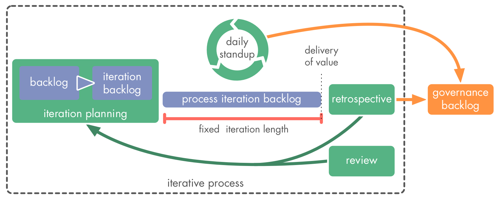
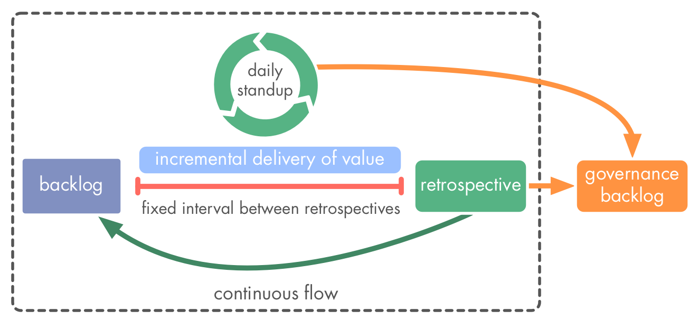

## What is it? ##

A retrospective is a facilitated, short and effective meeting that allows a group to collectively reflect on its  effectiveness at regular intervals. Various retrospective patterns can be used to generate insights and identify improvements, usually either operational tasks or agenda items for a [Governance Meeting].

##  Why use it? ##

Retrospectives support a team in seeing the bigger picture, in identifying more complex types of waste, and in discovering what is important beyond what is merely urgent. 

The facilitator creates and maintains a safe space for reflection, and selects patterns for the retrospective dependent on context and guides the team through all phases of the retrospective.

Short intervals between retrospectives allow for learning while the memory is still fresh, and for the implementation of a constant stream of small changes which can be implemented quickly and without fear.

When a group gets into the habit to reflecting on its effectiveness together they build stronger relationships and amplify learning through exploring and integrating different views on the past. Without an opportunity for collective reflection a group must rely on suggestions for improvements from individual (and thus incomplete) perspectives.

## How to implement it? ##

A retrospective is time-boxed, usually to 60 minutes, and happens in a regular cadence (between 1-4 weeks). 

The **goal** of a retrospective is reflection on the past to discover opportunities for improvement. 

The **output** of a retrospective are proposals for agreements, tensions, drivers or tasks

Questions answered in a retrospective include: 

* What can we learn from the last iteration of work?
* Are our tools still sharp enough?
* Are we still going in the right direction?

## Phases of a Retrospective Meeting ##

A retrospective has five distinct phases, with many different activities available for each phase:

1. Set the Stage 
2. Gather Data
3. Generate Insights
4. Decide What to Do
5. Close the Retrospective

The facilitator picks activities that support the team in collaborating on moving forward, taking into account the situation the team is in, the challenges they're facing, the system around the team and the personalities of the team members.

Activities for each phase can be found at [plans-for-retrospectives.com](http://www.plans-for-retrospectives.com/)
