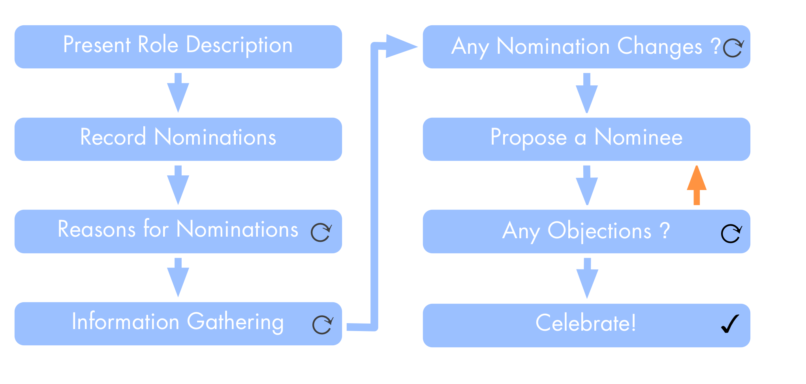

## What is it? ##

Instead of people being assigned to or volunteering for functions in an organization, we can select them on the basis of their qualifications for that function.

Following the facilitated process for sociocratic elections (as laid out in the implementation section below) the group suggests candidates, presents arguments for their qualifications, and then consents to one candidate fulfilling the required function __for a limited term__.

##  Why use it? ##

There is no emergent group wisdom in volunteering or assignment, both methods have a strong bias towards certain traits of personalities that are not necessarily correlated to good performance in a role or function. 

## How to implement it? ##

The facilitator guides the group through the stages of the election process, and actively prevents discussion or dialog. 

It helps to remind the group that asking for volunteers or who would be interested (or not interested) would anchor the decision and move it away from the arguments presented.

### Present Role Description ###

The facilitator presents the (previously consented to) description of the role or function, usually a combination of : 

* term
* responsibilities
* resources
* desired experience, skills and qualities
* criteria, procedure and intervals of evaluation

It's important to never elect for unlimited terms, a new election after a term has expired allows for an natural expression of the emergent wisdom of the group around who should hold that role.

### Record Nominations ###

Each member of the group writes down their name and the name of their desired candidate (or "no nomination" or "hire from the outside") hands in their nomination to the facilitator. 

You can use sticky notes with  the following format: name of the candidate large and in the center, your name on the bottom in smaller print.

That way the facilitator can easily work with the nominations in the following rounds.

### Reasons for Nominatons ###

"_What are the reasons for selecting your candidate?_"

The facilitator invites each member of the group to share the arguments why they selected their candidate. If the nominations are on sticky notes the facilitator can stick them to a wall one by one as the nominations are explained.

### Information Gathering ###

"_Is there anything else you would like to share?_"

In another round, the circle then shares comments, questions and other important information while the facilitator helps to avoid discussion or dialog.

### Change Nominations ###

"_Do you want to change your nomination? If so, please share the reason why._"

This round gives participants the chance to change their nominations on the basis of what they have learned in the previous round. Participants need to share the reasons for changing their nominations, and may ask questions to a potential candidate for clarifying information about themselves.

On changing a nomination, participants fill in a new election slip for the facilitator.

### Facilitator Proposes Nominee ###

Now the facilitator summarises the nominations and the arguments and proposes the candidate with the strongest arguments as a nominee for selection.

At this point, a discussion of the presented candidate is not necessary, the facilitator may remind the group that there is value in moving forward quickly and they can raise concerns or objections in the consent round that follows.

### Hear Objections ###

"_Do you haven any objections to selecting ... for this role ?_"

The facilitator begins the consent round next to the candidate so the candidate is asked last. Participants answer the question with either "_yes_" or  "_no_", the objection itself is shared in the next stage.

### Resolving Objections ###

Those with objections share the reasons for their objections, but there's no discussion before the round has finished.

The facilitator has several options to resolve objections (see [Resolve Objections](resolve-objections.html)), in many cases an amendment to the role description (e.g. a shorter term) followed by another consent round will be enough.

If an amendment of the role description is not possible, the facilitator would select another candidate from the nominations and start a new consent round.

If the role cannot be filled, the group might decide to use [Proposal Forming](proposal-forming.html) to deal with the issue.

## Goes well with... ##

Elections benefit from a good [Role Description](role-description.html) and regular [Effectiveness Review](effectiveness-review.html). Both the facilitator and the group need to understand the pattern of [Rounds](rounds.html). 

### Other comments ###

* People avoid expressing interest before elections 
* Nominations are made on the strength of the reason
    * not according to the majority
* You can nominate yourself or pass
* When harvesting objections, ask the candidate last
* Objections may be resolved by amending the role description or by nominating someone else

