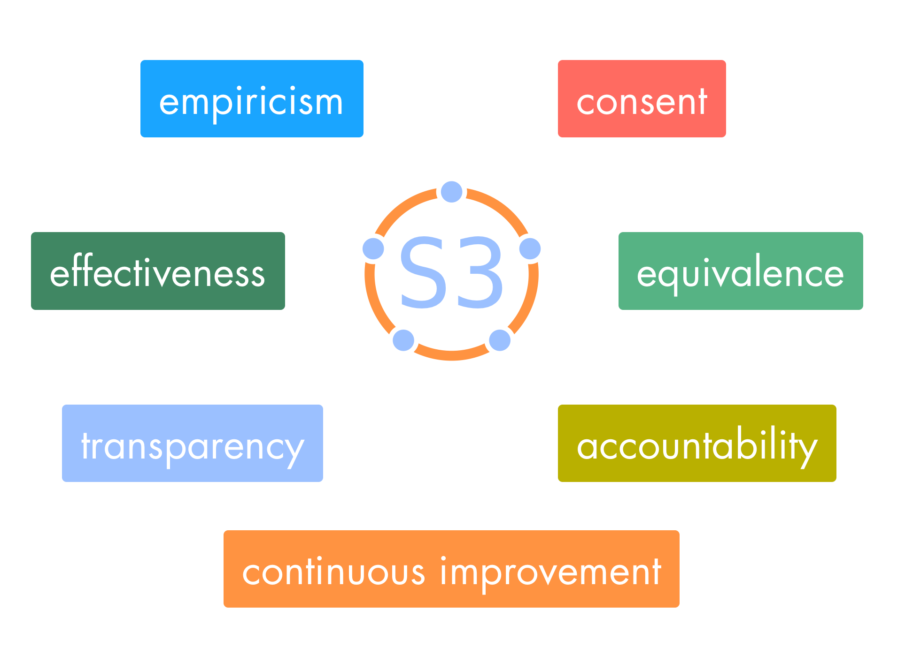

## The Seven Principles ##

S3 is built on seven core principles, which can also be considered as values that shape organizational culture. Understanding these principles is helpful for adopting and paramount to adapting S3 patterns.

Practicing S3 helps people appreciate the essential value of the Seven Principles, both to individuals and organizations

**The Principle of Effectiveness:** *Devote time only to what brings you closer towards achieving your objectives.*

Avoid waste, remove impediments and look for solutions which are *good enough for now, safe enough to try*.

**The Principle of Consent:** *Do things only in the absence of reasons why doing so would stand in the way of (more) effectively meeting shared objectives.*

When dealing with complexity, group wisdom exceeds individual abilities. Deliberately seeking out objections invites collective intelligence to improve an agreement and helps identify misunderstanding early. This fosters support and accountability for agreements made.

**The Principle of Empiricism:** *Test all assumptions about an organization and its interactions through experiments, continuous revision and falsification.*

In any complex adaptive system, such as a group or an organization, all knowledge about the system and its interactions is tentative, and highly dependent on context. Making use of experiences gained from probing and observing the system creates a learning organization which is effective and resilient to change.

Empiricism is the basis of the scientific method and the combined application of S3's patterns provides a direct way to apply the scientific method in an organization.

**The Principle of Continuous Improvement:** *Respond to change in small increments, by building on and transforming what is already there, to reduce risk and resistance, and to accommodate steady empirical learning*

Most of the time evolution is more effective and more sustainable than revolution. Continuous improvement applies to everything,  e.g. strategies, guidelines, products, skills, processes, values and tools. 

**The Principle of Equivalence:** *People affected by decisions can influence and change them on the basis of reason to do so.*

Position, rank, function and role have no special influence in decision making.

**Transparency:** *Make all information accessible to anyone in an organization. Confidentiality requires consent.*

All relevant information is kept up-to-date, and historical information is archived for reference.

**The Principle of Accountability:** *Respond when something is needed and be accountable for doing what you agreed to.** 

The principle of accountability applies to groups, organizations and individuals, and promotes a shift from being *held to account*, and towards a culture of *self-accountability*.

It implies both making commitments and managing expectations in any relationship: entering agreements, doing what we agree to and to answer for when we don’t. 

 

