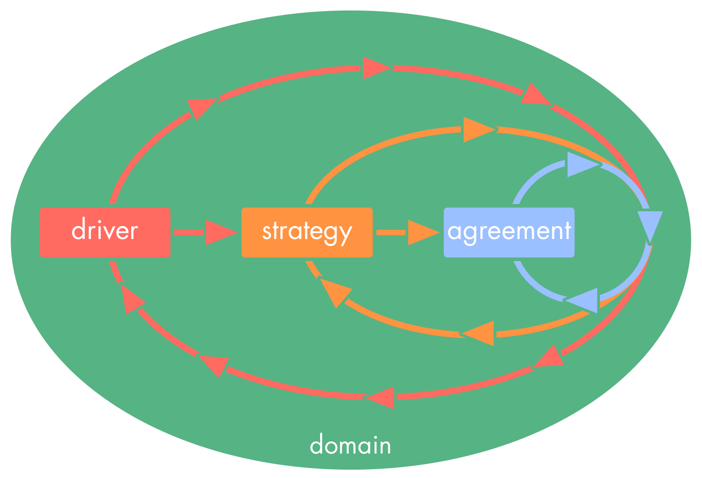

A **strategy** is the generic approach we choose to address a problem or a driver.

When facing a complex problem or driver, we usually don't know what will be the best way of responding to it. In order to reduce uncertainty, we first decide which general approach - our *strategy* - sounds most convincing. 

A strategy is implemented through breaking it down into a series of decisions (or agreements) supporting the strategy. Along the way we need to discover both how to effectively execute on the strategy and the strategy's overall effectiveness. 

In this context, all decisions we make are experiments, and how we slice our experiments, and in which order we run them affects how fast we learn - generally we would favor small experiments over large ones, and start with those which promise to reduce uncertainty or risk the most.

We can specifically design experiments so they support learning about creating a better experiment next time, and help us decide whether or not to persevere with the strategy.

As soon as we discover that the strategy is not effective or successful, we need to "pivot", i.e. use what we learned from our experiments to adjust the strategy or create a new one.