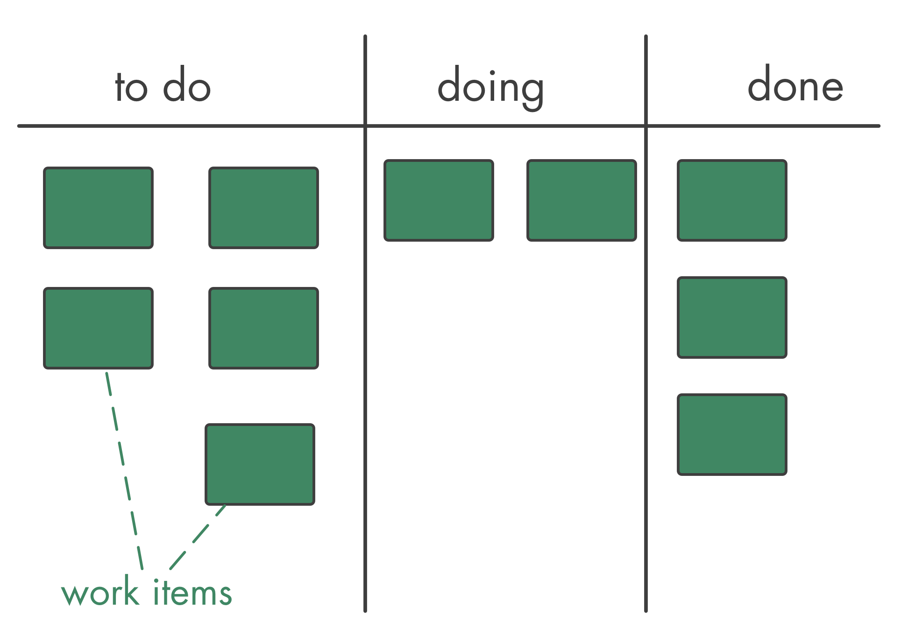
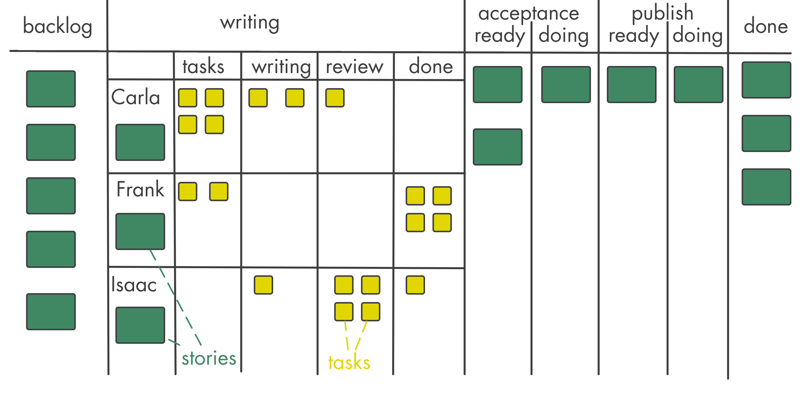
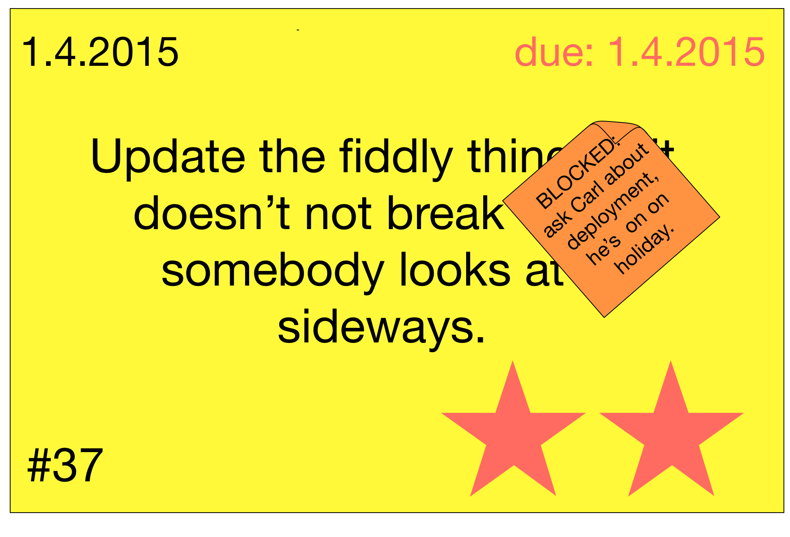

In order to empower a circle for self-organization, we need to make transparent both the agreed upon work process and the state of all work items currently in planning, in progress or completed. Only if all work items are visible to all circle members, people can pull in work when they have capacity, instead of work being pushed by a coordinator. 

Collocated teams can do this with post-its on a wall, or with index cards and magnets on a white board. Distributed teams can use an ever increasing number of apps available for this use case , from generic tools like [Google Sheets](http://sheets.google.com) or digital whiteboards, to task management systems for teams (e.g. [Asana](http://asana.com), [Todoist](http://todoist.com)) or dedicated apps for task boards or kanban boards ([Trello](http://trello.com), [Kanbanery](http://kanbanery.com), [Leankit](http://leankit.com)). Many teams use both a digital system and a card wall, and synchronize them once a day, commonly around the daily standup.

When visualizing work, first try to identify what different types of work items you have, e.g. customer request, project tasks, reporting tasks, rework. Decide whether or not it is necessary to distinguish between these types of work items, and how you are going to make that visible on your board, will you use colors, or symbols, or highlights? Are there different priorities, expedite items that take priority, and if so, how do you express ?

Then figure out what stages these work items go through, like "to do", "in progress", "review" and "done". At this stage, simply visualize what you're  doing already, don't make any changes to your process. You might end up with a very simple layout, or something rather complicated. Implement the layout in the system you thinks makes the most sense for you now, on a wall, or with software.

If you have any agreements guiding your workflow, e.g. which items have priority over others, or what is necessary for an item to move forward, quality standards and the like, it's a good idea to make them visible next to your board, so you can get together and review, discuss and update these agreements to improve the flow of items through your board.

## Things to Track in Your System 

* **types of work items** (e.g. customer request, project tasks, reporting tasks, rework)
* **start date** and optionally **due date**
* **priorities**
* **stages** of work (e.g. "to do", "in progress", "review" and "done")
* blocks
* who is working on which items
* agreements and expectations guiding workflow (e.g. definition of done, policy, quality standards)
* use colors, symbols, highlights etc.
